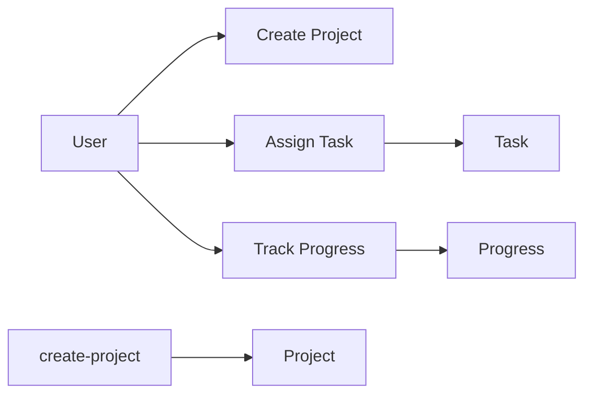
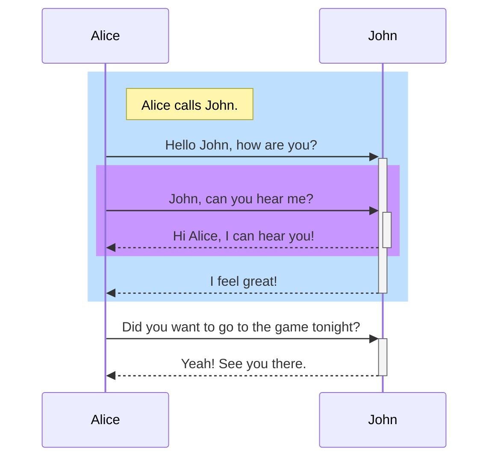
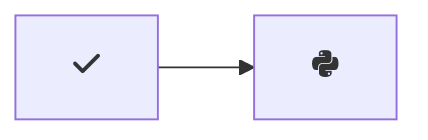

|          |                                              |
| -------- | -------------------------------------------- |
| Homesite | `VIEW[{url}][text(renderMarkdown)]`          |
| MS Learn | `VIEW[{ms-learn-url}][text(renderMarkdown)]` |

> [!NOTE] Definition
> `VIEW[{definition}][text(renderMarkdown)]`

  
  

