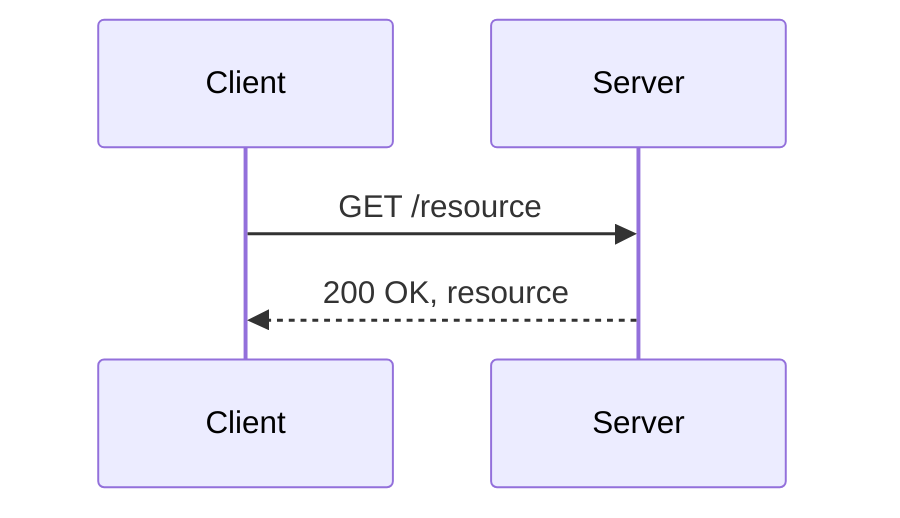
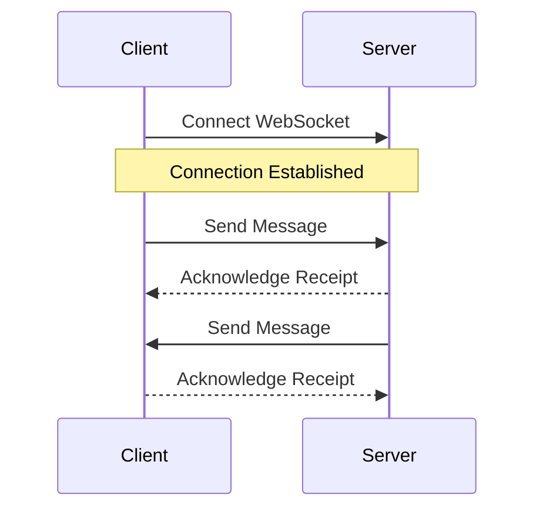
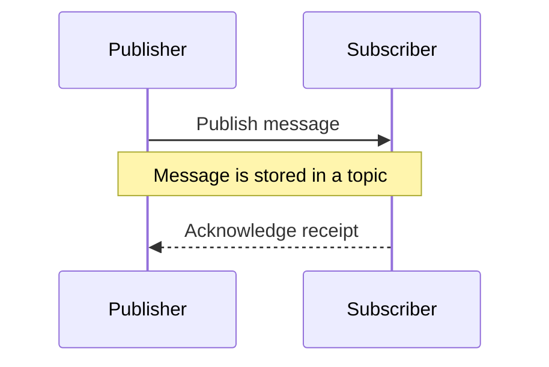
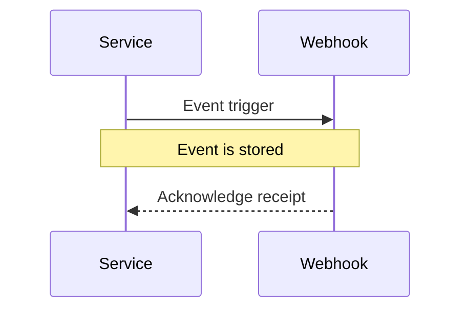
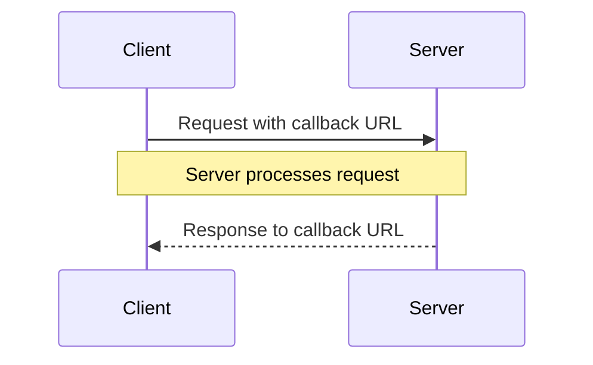

|          |                                              |
| -------- | -------------------------------------------- |
| Homesite | `VIEW[{url}][text(renderMarkdown)]`          |
| MS Learn | `VIEW[{ms-learn-url}][text(renderMarkdown)]` |

> [!NOTE] Definition
> `VIEW[{definition}][text(renderMarkdown)]`

## Design guidelines

Ref: [pdf](https://filedn.eu/lLCDT28fW4ahdtipln72iIF/public-vault-media/pdfs/A-Comprehensive-Guide-to-API-Design.pdf)

 API Design Process
Designing an API involves several important steps that ensure its effectiveness and usability. Following
a structured process will allow you to create an API that meets the needs of target audience. Let’s
explore the key steps in the API design process in more detail.

> [!NOTE]
> Include links to related resources in the models you return, easier to adopt the API, no lookup of how to get the related info.

### Plan   

• Purpose of API
• Scope of API
• API Objectives
• Target Audience
of API
### Design

• Resource
Endpoints
• Request and
Response
Formats
• Authentication
and
Authorization
Mechanisms
### Implement

• Programming
Language and
Framework
• Error handling
• Input Validation
• Documentation
### Test

• Design Time
Testing
• Testing After
Deployment 
## Different ways to connect to an API

### Rest API

### Web Socket

### Publish  Subscribe

### Webhooks

### Callback Urls

